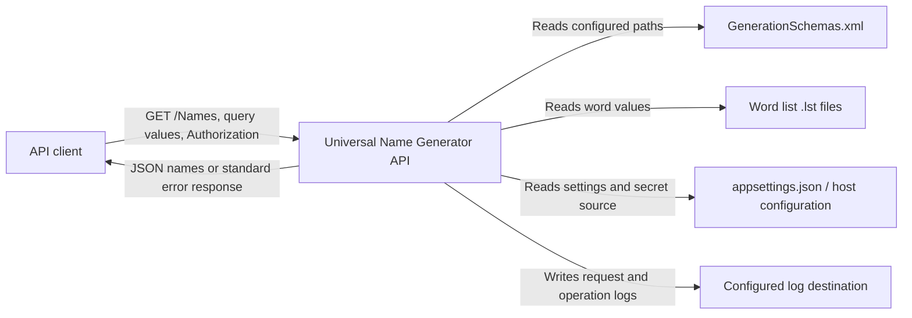
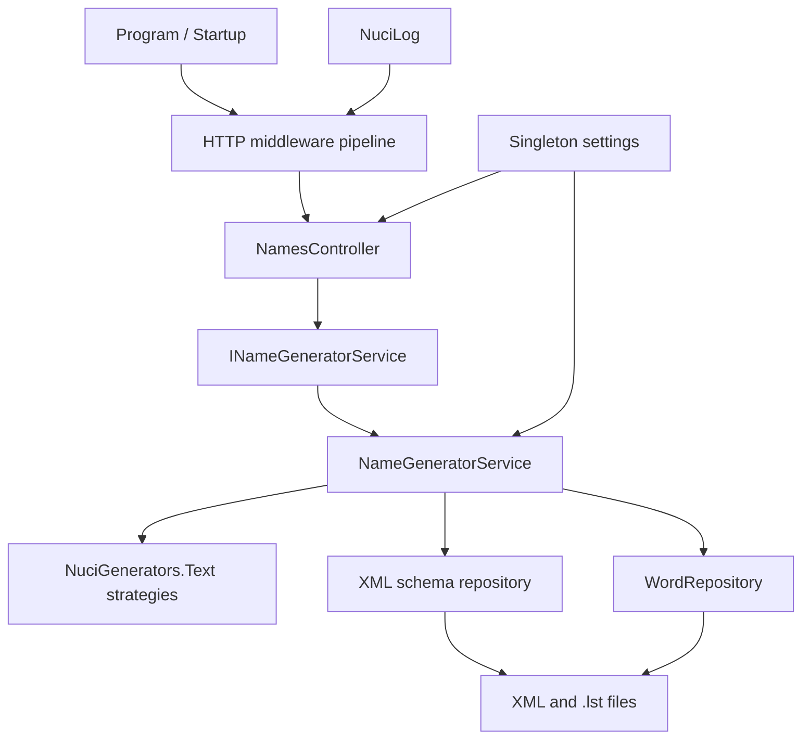
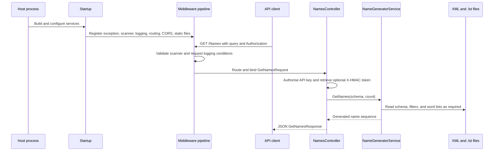
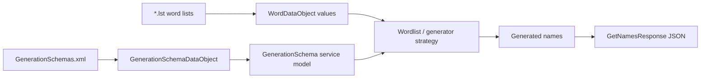
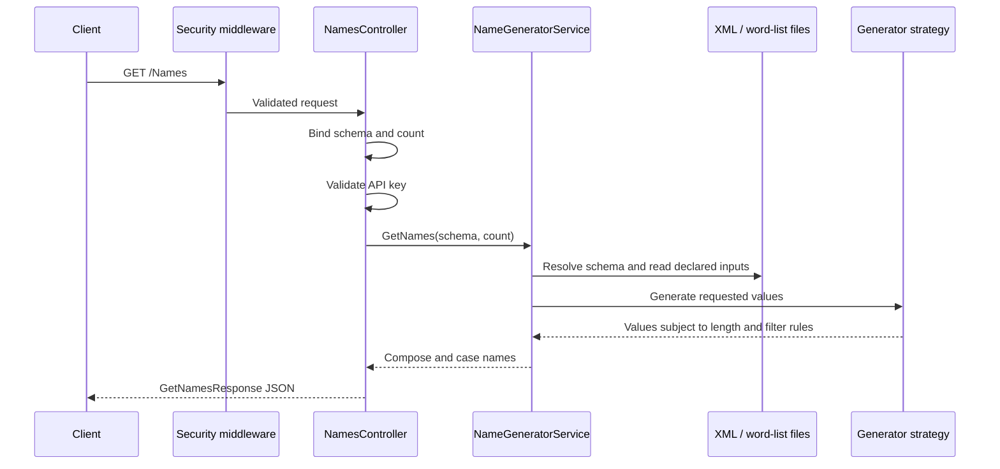
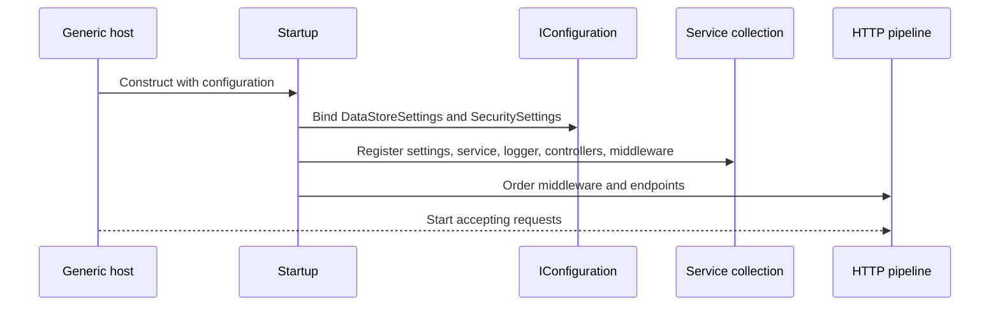
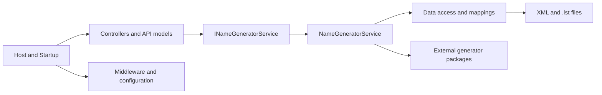

# Universal Name Generator API Architecture

This document records the current architecture of the Universal Name Generator API. It covers the ASP.NET Core process, its HTTP boundary, schema-driven name-generation service, file-backed data sources, middleware, configuration, deployment, and verification boundaries. It does not define a target architecture or prescribe an unimplemented redesign.

## 📑 Table of Contents

- [Purpose](#-purpose)
- [System Context](#-system-context)
- [Architectural Style](#-architectural-style)
- [Runtime Flow](#-runtime-flow)
- [Components](#-components)
- [Architectural Areas](#-architectural-areas)
  - [Host And Pipeline](#host-and-pipeline)
  - [Application Services](#application-services)
  - [Data Access](#data-access)
- [Data Architecture](#-data-architecture)
- [Interfaces And Integrations](#-interfaces-and-integrations)
- [Key Flows](#-key-flows)
  - [Name Generation Request](#name-generation-request)
  - [Configuration And Startup](#configuration-and-startup)
- [Schema-Driven Name Generation](#-schema-driven-name-generation)
- [Cross-Cutting Concerns](#-cross-cutting-concerns)
  - [Security And Privacy](#security-and-privacy)
  - [Error Handling](#error-handling)
  - [Observability](#observability)
  - [Configuration](#configuration)
  - [Concurrency And Resource Use](#concurrency-and-resource-use)
- [Dependency Direction And Rules](#-dependency-direction-and-rules)
- [External Dependencies](#-external-dependencies)
- [Deployment And Operations](#-deployment-and-operations)
- [Compatibility Contracts](#-compatibility-contracts)
- [Testing And Verification](#-testing-and-verification)
- [Design Constraints](#-design-constraints)
- [Extension Points](#-extension-points)
  - [Name Generator Service Substitution](#name-generator-service-substitution)
  - [Data-Driven Generator Extension](#data-driven-generator-extension)
- [Source Map](#-source-map)
- [Related Documentation](#-related-documentation)

## 🎯 Purpose

The system's principal responsibility is to expose configurable name generation over an authenticated HTTP API. This document defines the system boundary, component ownership, data representations, runtime flow, failure boundaries, and change-sensitive contracts for maintainers and contributors. It is a current-state description of the `net10.0` solution.

## 🌐 System Context

The system is a single ASP.NET Core process. An API client sends an authenticated `GET /Names` request containing a schema identifier and an optional count. The service reads generation schemas from XML and word lists from `.lst` files, generates names in memory, and returns a JSON response. Configuration supplies filesystem locations, the API key, and logging options. No database or remote application service is present in the repository.



The principal external boundaries are:
- **API client:** Owns the request and consumes the JSON success or error response. The client supplies the API key through the `Authorization` header.
- **Configuration provider:** Owns configuration values and secret injection. The application binds data-store, security, and logger settings at composition time.
- **Generation data files:** Own the XML schema records and `.lst` word values. The application reads them; it does not modify them.
- **Filesystem log destination:** Owns persisted log output when file logging is enabled. The application writes through `NuciLog`.

## 🏗️ Architectural Style

The implementation is a modular monolith using ASP.NET Core MVC, middleware composition, dependency injection, and a layered service/data-access separation. `Program` and `Startup` compose one deployable process. Middleware handles cross-cutting HTTP concerns, controllers adapt HTTP requests to application services, and `NameGeneratorService` owns schema interpretation and generator selection. File repositories adapt XML and text files to service models.



The principal architecture boundaries are:
- **Host and pipeline:** `Program` starts the host and `Startup` registers services and orders middleware. It may depend on all application components required for composition, but application services do not depend on the host.
- **HTTP boundary:** `NamesController` and `INamesController` own route and request/response adaptation. They depend on `INameGeneratorService` and security settings rather than constructing the generator service.
- **Application service:** `INameGeneratorService` and `NameGeneratorService` own schema lookup, command parsing, generator selection, casing, filtering, and name composition.
- **Data access:** XML repository usage and `WordRepository` own file representation concerns. Mapping extensions convert data objects to generator-library service models.
- **External generator libraries:** `NuciGenerators.Text` and its strategy packages perform the specialised generation algorithms. The application configures and invokes them but does not own their internal algorithms.

## 🔄 Runtime Flow



The principal runtime sequence is:
1. `Program.CreateHostBuilder` creates the generic host and selects `Startup` as the web-host startup class.
2. `Startup.ConfigureServices` registers controllers, CORS, singleton settings, scanner protection, the scoped name-generation service, and logging.
3. `Startup.Configure` orders exception handling, scanner protection, request logging, HTTPS redirection, CORS, static files, routing, authorisation, and controller endpoints.
4. A request reaches `NamesController.GetNames` after model binding and API-key authorisation.
5. `NameGeneratorService` resolves the schema, loads required file data, invokes the configured generator strategy, applies filters and casing, and returns names.
6. The controller returns the generated names in the NuciAPI response contract; middleware translates exceptions into standard HTTP error responses.

## 🧩 Components

| Component | Responsibility | Principal Dependencies | Lifetime or Ownership |
|-----------|----------------|------------------------|-----------------------|
| `Program` | Creates and runs the generic web host. | ASP.NET Core hosting | Process entry point |
| `Startup` | Registers services and composes the HTTP pipeline. | ASP.NET Core, NuciAPI middleware, application extensions | Host composition owner |
| `NamesController` | Exposes `GET /Names`, authorises requests, and creates the response DTO. | `INameGeneratorService`, `SecuritySettings`, NuciAPI controllers | Controller instance per request |
| `NameGeneratorService` | Resolves schemas, interprets commands, invokes generators, filters values, and composes names. | `DataStoreSettings`, XML repository, `WordRepository`, Nuci generator libraries | Scoped service; generator dictionary is scoped with the service |
| `WordRepository` | Parses `.lst` files, removes inline comments, and groups values by identifier. | Filesystem, `WordDataObject` | Created for each requested word-list read |
| `GenerationSchemaDataObject` | Represents XML schema records at the data boundary. | `NuciDAL` entity base, XML serialisation | Owned by the XML repository |
| `WordDataObject` | Represents grouped word-list values at the data boundary. | `NuciDAL` entity base | Owned by `WordRepository` |
| `NuciAPI middleware` | Performs exception translation, scanner protection, request logging, and related HTTP concerns. | NuciAPI middleware packages, logging | Pipeline middleware |

## 🗂️ Architectural Areas

### Host And Pipeline

Paths:
- [`Program.cs`](UniversalNameGenerator.API/Program.cs)
- [`Startup.cs`](UniversalNameGenerator.API/Startup.cs)
- [`ServiceCollectionExtensions.cs`](UniversalNameGenerator.API/ServiceCollectionExtensions.cs)
- [`Configuration/`](UniversalNameGenerator.API/Configuration/)

Responsibilities:
- Create the process host and select the application startup class.
- Bind configuration sections and register service lifetimes.
- Establish middleware order, endpoint routing, CORS, HTTPS redirection, and static-file handling.

Boundary rules:
- Composition code owns registration and ordering; it does not implement name-generation algorithms.
- Configuration values are passed through settings objects rather than read directly by controllers.
- Middleware ordering is part of the HTTP behaviour and must be verified when changed.

### Application Services

Paths:
- [`Controllers/`](UniversalNameGenerator.API/Controllers/)
- [`Models/`](UniversalNameGenerator.API/Models/)
- [`Service/`](UniversalNameGenerator.API/Service/)
- [`Service/NameGenerators/`](UniversalNameGenerator.API/Service/NameGenerators/)

Responsibilities:
- Define the HTTP contract and request validation metadata.
- Resolve schemas and dispatch supported commands: `random`, `randomiser`, `random-selector`, and `markov`.
- Apply word casing, filters, composition, and generator-library configuration.

Boundary rules:
- Controllers depend on service contracts, not concrete data repositories.
- Generator implementations are selected by schema command syntax and remain behind the service boundary.
- Mapping extensions own conversions between data objects and service models.

### Data Access

Paths:
- [`DataAccess/`](UniversalNameGenerator.API/DataAccess/)
- [`DataAccess/DataObjects/`](UniversalNameGenerator.API/DataAccess/DataObjects/)
- [`DataAccess/Repositories/`](UniversalNameGenerator.API/DataAccess/Repositories/)

Responsibilities:
- Represent XML schema records and grouped word-list values.
- Read and parse XML and `.lst` files.
- Provide data objects to the service mapping layer.

Boundary rules:
- File parsing remains in data-access types and is not duplicated in controllers or generator strategies.
- Data objects are converted to external generator models through mapping extensions.
- The current data access boundary is read-only from the API process.

## 💾 Data Architecture

The application owns transient request data and reads two file-backed source formats. Generation schemas are loaded through `NuciDAL.XmlRepository<GenerationSchemaDataObject>`. Word lists are read by `WordRepository`, which clears its in-memory dictionary before each read, strips inline comments beginning at `#`, and aggregates values sharing an identifier after `_`. Generated names are composed in memory and transmitted in the HTTP response; they are not persisted by this repository.



| Data or Store | Owner | Representation and Storage | Lifecycle or Consistency |
|---------------|-------|----------------------------|--------------------------|
| Generation schemas | `NameGeneratorService` through `XmlRepository` | XML records in the configured `generationSchemasPath` | Read when schemas are requested; source remains external and unchanged |
| Word lists | `WordRepository` and `NameGeneratorService` | UTF-8/text `.lst` files below `wordListsRootDirectory` | Read for generator construction; repository contents are rebuilt on each read |
| Filter list | `NameGeneratorService` | A `.lst` file resolved below the configured word-list root | Read per generation operation when a schema declares a filter path |
| Request model | ASP.NET Core model binding and `NamesController` | Query values mapped to `GetNamesRequest` | Exists for one request; `Count` defaults to `1` and is constrained to `1..100000` |
| Generator instances | `NameGeneratorService` | In-memory dictionary keyed by schema identifier | Scoped to one service instance; not persisted or shared as a process-wide cache |
| Generated names | `NameGeneratorService` and controller response | In-memory `IEnumerable<string>` and JSON `names` array | Created per request and discarded after response processing |

## 🔌 Interfaces And Integrations

| Interface or Integration | Direction | Contract | Owner | Failure Semantics |
|--------------------------|-----------|----------|-------|-------------------|
| `GET /Names` | Inbound | Query `schema` and `count`; `Authorization` header; JSON response | `NamesController` | Model-binding failures produce `400`; authentication failures produce `401`; service exceptions are translated by middleware |
| NuciAPI authorisation | Inbound | API key in `Authorization`, with optional `Bearer` prefix | `NamesController` and NuciAPI controller base | Missing or invalid credentials produce an authentication error response |
| Optional `X-HMAC` header | Inbound | Token is retrieved into the NuciAPI request model | NuciAPI controller base | The endpoint transports the token; explicit HMAC validation is not invoked by `NamesController` |
| XML schema repository | Inbound | `GenerationSchemaDataObject` XML records | `NameGeneratorService` | File and deserialisation failures propagate to exception middleware |
| Word-list files | Inbound | `.lst` lines, optional `_` identifier separator, `#` inline comments | `WordRepository` | Missing or malformed files propagate as service failures |
| NuciAPI JSON response contract | Outbound | `success`, `message`, `code`, `hmac`, and `names` properties | `GetNamesResponse` and NuciAPI | Serialisation or deferred enumeration failures are handled by the exception pipeline when possible |

## 🔀 Key Flows

### Name Generation Request



The controller owns transport concerns and authorisation. The service owns schema lookup and generation. A missing schema raises a key-not-found failure, unsupported or malformed commands raise service exceptions, and the outer NuciAPI exception middleware maps those failures to standard responses. Generator strategies can return fewer values than requested when their own validity or uniqueness constraints cannot produce more values within their processing rules.

### Configuration And Startup



`appsettings.json` provides default section names and file paths, while the generic host configuration system supplies the effective values. The API key is represented by a configuration placeholder and must be injected through deployment configuration rather than committed as a secret. The startup path registers settings as singletons, the name-generation service and logger as scoped services, and middleware as part of the request pipeline.

## ⚙️ Schema-Driven Name Generation

A schema is an XML record with an identifier, display metadata, a schema expression, an optional filter-list path, and a word-case value. Generator expressions use `{command,...}` delimiters. The service repeatedly extracts generator expressions from the schema, generates one value collection per expression, then composes values by index. The supported command names are `random`, `randomiser`, `random-selector`, and `markov`.

`random` builds strings from inline choices and length bounds. `randomiser` combines configured word lists using a separator. `random-selector` selects values from word lists. `markov` constructs a Markov generator with order `4` and temperature/prior `0.0`. Filter values are passed to generator implementations as excluded strings. Casing is applied after composition through the configured `WordCase` value.

This format makes adding data-driven schemas possible without changing application code when an existing command and word-list arrangement is sufficient. Adding a new command requires changes in `NameGeneratorService`, its command parsing tests, and the corresponding integration coverage.

## 🧵 Cross-Cutting Concerns

### Security And Privacy

The API boundary uses NuciAPI API-key authorisation. The key is read from `SecuritySettings`, whose value comes from configuration and is represented in the committed `appsettings.json` only by a placeholder. Requests are subject to NuciAPI scanner protection and request logging middleware. CORS permits only the six configured localhost origins and allows headers and methods required by the API.

`GetNamesRequest` uses data-annotation range validation for `Count`; schema input is passed to exact ordinal schema lookup. The application does not intentionally persist personal data. Logging configuration can write to a configured file, so operators must protect that path and ensure secrets are not placed in loggable request data.

### Error Handling

NuciAPI exception middleware surrounds the application pipeline. It maps validation, argument, format, and bad-request failures to `400`; authentication failures to `401`; security and unauthorised-access failures to `403`; missing entities and keys to `404`; dependency, cancellation, and timeout failures to service-unavailable or client-closed responses; not-implemented failures to `501`; and unclassified failures to `500`. Controller success responses use NuciAPI success metadata.

Development mode additionally enables the ASP.NET Core developer exception page. Production-style integration tests use the NuciAPI exception contract. File, XML, generator, and serialisation failures remain owned by the service or middleware boundary where they originate.

### Observability

`NuciApiRequestLogging` and the registered `NuciLog` implementation provide request and operation logging. `NuciLogSettings` controls the configured file path and whether file output is enabled. The repository does not define metrics, distributed tracing, health endpoints, or an audit-event store. Operators therefore rely on application logs, HTTP responses, host process status, and deployment-level diagnostics.

### Configuration

| Configuration Area | Source | Responsibility | Override or Secret Policy |
|--------------------|--------|----------------|---------------------------|
| `DataStoreSettings` | `dataStoreSettings` configuration section | Locate `GenerationSchemas.xml` and the word-list root | Host configuration may override the committed defaults; paths must be valid for the deployment filesystem |
| `SecuritySettings` | `securitySettings` configuration section | Supply the API key used by controller authorisation | The committed value is a placeholder; inject the real secret through deployment configuration |
| `NuciLogSettings` | `nuciLoggerSettings` configuration section | Control log path and file-output enablement | Host configuration may override defaults; log files require protected filesystem permissions |
| CORS origins | Static `Startup.AllowedCorsOrigins` property | Restrict browser-origin access | Changes require a source change and regression verification |

### Concurrency And Resource Use

ASP.NET Core processes requests concurrently. `INameGeneratorService` is scoped, so its `generatorsBySchemaId` dictionary is not a process-wide shared cache. Each generation operation creates a `Random` instance, and file reads occur synchronously. The service does not define a queue, backpressure policy, cancellation-token path, or explicit request timeout. The request count upper bound is `100000`, while the effective output count may be lower for generator strategies with uniqueness or validity constraints.

## 🧭 Dependency Direction And Rules

The composition root points inward to controllers, services, configuration, and middleware registration. Controllers depend on service contracts. The application service depends on data objects, repository abstractions or implementations, mapping extensions, and generator-library types. Data-access code does not depend on controllers or HTTP models.



The principal dependency rules are:
- Controllers consume `INameGeneratorService` and do not parse generation files.
- `NameGeneratorService` owns command interpretation and generator selection; generator packages do not own HTTP concerns.
- File parsing remains in repositories or repository-backed adapters; mappings remain in mapping extension types.
- Configuration is injected through settings objects at composition time rather than discovered by domain logic.
- Tests may substitute `INameGeneratorService` at the integration host boundary, while production composition registers `NameGeneratorService`.

## 📦 External Dependencies

| Dependency | Responsibility | Integration Boundary | Architectural Consequence |
|------------|----------------|----------------------|---------------------------|
| `Microsoft.AspNetCore.App` | Hosting, MVC, middleware, routing, configuration, and dependency injection | `Program`, `Startup`, controllers | The process lifecycle and HTTP behaviour follow ASP.NET Core conventions |
| `NuciAPI` and `NuciAPI.Controllers` | Request/response contracts, API-key authorisation, and HMAC request metadata | `NuciApiRequest`, `NuciApiResponse`, `NuciApiController` | Response fields, authentication headers, and exception semantics are external contracts |
| `NuciAPI.Middleware.*` | Exception handling, scanner protection, and request logging | `Startup.Configure` | Middleware order and package behaviour affect security and failure translation |
| `NuciDAL` | XML repository and entity base abstractions | `NameGeneratorService` data access and data objects | Schema loading follows the external repository abstraction |
| `NuciGenerators.Text` | Base generator models and word-list abstractions | `NameGeneratorService` and mappings | Supported generation strategies and model shapes are package contracts |
| `NuciGenerators.Text.MarkovChain` | Markov name generation | `GenerateMarkovNames` | Markov order and temperature are configured by the application |
| `NuciLog` and `NuciLog.Core` | Logger implementation and logger contract | Service registration and request middleware | Logging lifetime and output depend on the package integration |
| `NuciSecurity.HMAC` | HMAC order and metadata attributes | Request model and NuciAPI response/request types | Property ordering metadata is part of the request/response compatibility boundary |

## 🚀 Deployment And Operations

The deployment unit is one .NET 10 web process started through `Program`. The application requires a filesystem containing the configured XML schema file and word-list files. It can redirect HTTP requests to HTTPS, serves static files if present, and exposes controller endpoints through ASP.NET Core routing. The repository does not define a database, background worker, queue, external service client, or multi-process topology.

| Concern | Current Design | Architectural Consequence |
|---------|----------------|---------------------------|
| Process topology | One ASP.NET Core web process | Availability and throughput depend on the hosting process and deployment platform |
| Configuration | Host configuration plus `appsettings.json` defaults | Operators must inject the API key and provide valid data paths |
| Filesystem state | XML schemas, `.lst` word lists, and optional log file | Deployment must mount or package compatible files and protect writable log paths |
| Network boundary | HTTP pipeline with HTTPS redirection and CORS | TLS termination, listener configuration, and public exposure are deployment responsibilities |
| Scaling | No shared application cache or persistent generated-name state | Multiple instances can read the same source files, but generated output is not coordinated between instances |
| Continuous integration | GitHub Actions restores, builds, and tests the solution on Ubuntu with .NET 10 | Build and test compatibility is part of the delivery boundary |

## 🛡️ Compatibility Contracts

| Contract | Owner | Invariant | Verification | Change Policy |
|----------|-------|-----------|--------------|---------------|
| `GET /Names` route | `NamesController` | Route is controller-based and accepts the `Names` path with `schema` and `count` query values | Integration controller and routing tests | Treat route and query names as public API; coordinate any change with clients |
| API-key authorisation | `NamesController` and NuciAPI | API key is supplied through `Authorization`, with optional `Bearer` prefix handling | Integration authorisation tests | Preserve header semantics and secret injection behaviour |
| NuciAPI JSON response | `GetNamesResponse` and NuciAPI response base | JSON includes `success`, `message`, `code`, `hmac`, and `names` with standard success/error metadata | Integration response assertions | Preserve property names and response codes unless a versioned contract change is intended |
| Request validation | `GetNamesRequest` | `Count` defaults to `1` and accepts only values from `1` through `100000` | Integration validation tests | Preserve range and binding semantics for existing clients |
| Schema expression syntax | `NameGeneratorService` | Delimiters, command names, argument positions, separators, and casing values retain their current meanings | Unit and production-service integration tests | Add commands compatibly; do not silently reinterpret existing expressions |
| Word-list format | `WordRepository` | `_` groups values by identifier and `#` removes inline comments | Repository unit tests and production-service integration tests | Preserve parsing rules for existing `.lst` files |
| Configuration sections | `ServiceCollectionExtensions` | `DataStoreSettings`, `SecuritySettings`, and `NuciLoggerSettings` retain their section names and key meanings | Application startup and integration tests | Treat section names and secret source as deployment contracts |

## ✅ Testing And Verification

The solution contains unit tests for data objects, repositories, and service logic, plus integration tests that host the production HTTP pipeline. Integration coverage includes HTTP binding, authentication, CORS, routing, scanner protection, exception translation, response serialisation, real file-backed generation strategies, and concurrent requests. The production service remains stochastic for random, selector, randomiser, and Markov strategies, so tests assert invariants such as count bounds, allowed values, casing, lengths, and exclusions rather than a single random sequence.

Execute the principal automated verification with:

```bash
dotnet test UniversalNameGenerator.API.slnx
```

CI performs the equivalent restore, build, and test sequence through [`.github/workflows/dotnet.yml`](.github/workflows/dotnet.yml). Manual verification should confirm that deployed data paths exist, the API key is injected, HTTPS termination is configured, and log output is written only to an appropriately protected destination.

## ⚠️ Design Constraints

- **File-backed source data:** Schemas and word lists are external files rather than database records; deployments must preserve paths, formats, encoding, and permissions.
- **Synchronous file and generation work:** File reads and generator calls are synchronous, so long generation requests consume request-processing threads and have no explicit cancellation path.
- **Scoped generator state:** Generator instances are cached only inside a scoped service instance; there is no cross-request or cross-instance uniqueness guarantee.
- **Bounded request count:** Model validation accepts at most `100000`, but generator validity and uniqueness rules can still produce fewer values.
- **Third-party contract coupling:** HTTP response metadata, authorisation, middleware behaviour, XML repository behaviour, and generator models depend on versioned Nuci packages.
- **Single-process operations:** There is no repository-defined queue, worker, durable generated-name store, health endpoint, or distributed coordination mechanism.
- **Environment-dependent error presentation:** Development mode enables the ASP.NET Core developer exception page, while production-style execution relies on NuciAPI exception translation.

## 🔧 Extension Points

### Name Generator Service Substitution

1. Implement or revise the [`INameGeneratorService`](UniversalNameGenerator.API/Service/INameGeneratorService.cs) contract.
2. Register the implementation in [`ServiceCollectionExtensions.cs`](UniversalNameGenerator.API/ServiceCollectionExtensions.cs) at the `AddCustomServices` composition boundary.
3. Add unit tests for service logic and integration tests for the HTTP contract and failure behaviour.

The implementation must preserve synchronous service semantics, return `IEnumerable<string>` values, and retain the controller's request and response contract. Integration tests currently substitute this contract to isolate HTTP behaviour; production composition registers `NameGeneratorService` as scoped.

### Data-Driven Generator Extension

1. Add compatible XML schema and `.lst` data under the configured data-store paths.
2. Use an existing command syntax and word-list arrangement, or revise `NameGeneratorService` command parsing when introducing a new command.
3. Add representative repository, service, and production-service integration verification.

New data must preserve schema identifiers, command argument positions, word-list separators, filter-list semantics, and casing values. A new algorithm cannot be introduced solely through data if it is not already supported by the service command dispatcher.

## 🗺️ Source Map

| Area | Path |
|------|------|
| Host and startup | [`Program.cs`](UniversalNameGenerator.API/Program.cs), [`Startup.cs`](UniversalNameGenerator.API/Startup.cs) |
| Configuration | [`Configuration/`](UniversalNameGenerator.API/Configuration/) and [`appsettings.json`](UniversalNameGenerator.API/appsettings.json) |
| HTTP contract | [`Controllers/`](UniversalNameGenerator.API/Controllers/) and [`Models/`](UniversalNameGenerator.API/Models/) |
| Application service | [`Service/`](UniversalNameGenerator.API/Service/) |
| Data access | [`DataAccess/`](UniversalNameGenerator.API/DataAccess/) |
| Unit verification | [`UniversalNameGenerator.API.UnitTests/`](UniversalNameGenerator.API.UnitTests/) |
| Integration verification | [`UniversalNameGenerator.API.IntegrationTests/`](UniversalNameGenerator.API.IntegrationTests/) |
| Continuous integration | [`.github/workflows/dotnet.yml`](.github/workflows/dotnet.yml) |
| Release entry point | [`release.sh`](release.sh) |

## 📚 Related Documentation

- [`README.md`](README.md): Installation, usage, configuration, development commands, project structure, and contribution guidance.
- [`LICENSE`](LICENSE): GNU General Public License v3.0 or later terms for distribution and modification.
