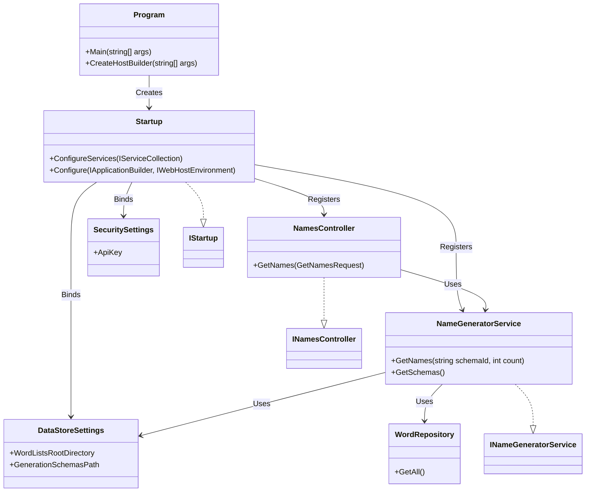

# Universal Name Generator API - Component Reference

## Overview

This document provides detailed reference documentation for each component in the Universal Name Generator API repository, including implementation details, responsibilities, and relationships.

---

## Core Components

### Program.cs

**Path**: `UniversalNameGenerator.API/Program.cs`

**Purpose**: Application entry point and host creation

**Implementation**:
```csharp
public static class Program
{
    public static void Main(string[] args)
        => CreateHostBuilder(args).Build().Run();

    public static IHostBuilder CreateHostBuilder(string[] args) => Host
        .CreateDefaultBuilder(args)
        .ConfigureWebHostDefaults(webBuilder =>
        {
            webBuilder.UseStartup<Startup>();
        });
}
```

**Key Responsibilities**:
- Entry point for the application
- Creates the generic host using `Host.CreateDefaultBuilder()`
- Configures web host defaults with `Startup` class
- Starts the application with `Run()`

**Dependencies**: None (entry point)

**Lifetime**: Process lifetime

---

### Startup.cs

**Path**: `UniversalNameGenerator.API/Startup.cs`

**Purpose**: Service registration and HTTP pipeline configuration

**Implementation**:
```csharp
public sealed class Startup(IConfiguration configuration) : IStartup
{
    private static string[] AllowedCorsOrigins =>
    [
        "http://localhost:5000",
        "https://localhost:5001",
        "http://localhost:7000",
        "https://localhost:7001",
        "http://localhost:8080",
        "http://localhost:8081"
    ];

    public IConfiguration Configuration => configuration;

    public void ConfigureServices(IServiceCollection services)
    {
        services.AddControllers();
        services.AddCors(options => { /* CORS policy */ });
        services.AddConfigurations(Configuration)
                .AddNuciApiScannerProtection()
                .AddCustomServices();
    }

    public void Configure(IApplicationBuilder applicationBuilder, IWebHostEnvironment hostingEnvironment)
    {
        applicationBuilder.UseNuciApiExceptionHandling();
        applicationBuilder.UseNuciApiScannerProtection();
        applicationBuilder.UseNuciApiRequestLogging();
        // ... middleware ordering
    }
}
```

**Key Responsibilities**:
- Register controllers and CORS policy
- Bind configuration and register services
- Configure HTTP middleware pipeline
- Define middleware ordering

**Middleware Order**:
1. Exception handling (first - catches all downstream errors)
2. Scanner protection (security)
3. Request logging (observability)
4. Developer exception page (development only)
5. HTTPS redirection
6. CORS
7. Static files
8. Routing
9. Authorization
10. Endpoint routing

**Dependencies**:
- `IConfiguration`: Configuration provider
- `IServiceCollection`: Service registration
- `IApplicationBuilder`: Middleware pipeline
- `IWebHostEnvironment`: Hosting environment

---

### ServiceCollectionExtensions.cs

**Path**: `UniversalNameGenerator.API/ServiceCollectionExtensions.cs`

**Purpose**: Custom service registration extensions

**Implementation**:
```csharp
public static class ServiceCollectionExtensions
{
    public static IServiceCollection AddConfigurations(
        this IServiceCollection services,
        IConfiguration configuration)
    {
        DataStoreSettings dataStoreSettings = new();
        SecuritySettings securitySettings = new();

        configuration.Bind(DataStoreSettingsSectionName, dataStoreSettings);
        configuration.Bind(SecuritySettingsSectionName, securitySettings);

        return services
            .AddSingleton(dataStoreSettings)
            .AddSingleton(securitySettings)
            .AddNuciLoggerSettings(configuration);
    }

    public static IServiceCollection AddCustomServices(this IServiceCollection services)
        => services
            .AddScoped<INameGeneratorService, NameGeneratorService>()
            .AddScoped<ILogger, NuciLogger>();
}
```

**Key Responsibilities**:
- Bind configuration sections to strongly-typed settings
- Register singleton configuration objects
- Register scoped service implementations
- Configure logging settings

**Service Lifetimes**:
- `DataStoreSettings`: Singleton (configuration)
- `SecuritySettings`: Singleton (configuration)
- `INameGeneratorService`: Scoped (per request)
- `ILogger`: Scoped (per request)

---

## HTTP Layer

### NamesController.cs

**Path**: `UniversalNameGenerator.API/Controllers/NamesController.cs`

**Purpose**: HTTP endpoint for name generation

**Implementation**:
```csharp
[Route("[controller]")]
[ApiController]
public sealed class NamesController(
    INameGeneratorService nameGeneratorService,
    SecuritySettings securitySettings) : NuciApiController, INamesController
{
    private readonly NuciApiAuthorisation authorisation = NuciApiAuthorisation.ApiKey(securitySettings.ApiKey);

    [HttpGet]
    public ActionResult GetNames([FromQuery] GetNamesRequest request)
        => ProcessRequest(
            request,
            () => new GetNamesResponse { Names = nameGeneratorService.GetNames(request.Schema, request.Count) },
            authorisation);
}
```

**Key Responsibilities**:
- Route `GET /Names` requests
- Bind query parameters to `GetNamesRequest`
- Validate API key authorization
- Delegate to `INameGeneratorService`
- Return `GetNamesResponse`

**Dependencies**:
- `INameGeneratorService`: Business logic
- `SecuritySettings`: API key configuration
- `NuciApiController`: Base controller functionality

**HTTP Contract**:
- Method: GET
- Route: `/Names`
- Query Parameters: `schema` (string), `count` (int, default: 1)
- Headers: `Authorization: Bearer {apiKey}`
- Response: JSON with `names` array

---

### INamesController.cs

**Path**: `UniversalNameGenerator.API/Controllers/INamesController.cs`

**Purpose**: Controller contract interface

**Implementation**:
```csharp
public interface INamesController
{
    ActionResult GetNames([FromQuery] GetNamesRequest request);
}
```

**Key Responsibilities**:
- Define controller contract for testing
- Enable mock implementations
- Support dependency inversion

---

## Application Layer

### NameGeneratorService.cs

**Path**: `UniversalNameGenerator.API/Service/NameGeneratorService.cs`

**Purpose**: Core name generation business logic

**Key Responsibilities**:
- Resolve schemas by identifier
- Load generation schemas from XML
- Load word lists from `.lst` files
- Select appropriate generator strategy
- Apply filters and casing
- Cache generators for performance

**Generation Strategies**:

1. **Random**: Simple random string generation
   - Syntax: `{random,wordlist1|wordlist2,minLength,maxLength}`
   - Generates random strings by concatenating random elements

2. **Randomiser**: Random combination with separator
   - Syntax: `{randomiser,separator,wordlist1|wordlist2,minLength,maxLength,wordlistKeys}`
   - Joins random elements from multiple wordlists with separator

3. **Random Selector**: Random selection from word lists
   - Syntax: `{random-selector,minLength,maxLength,wordlistKeys}`
   - Selects random elements from specified wordlists

4. **Markov Chain**: Markov chain-based generation
   - Syntax: `{markov,minLength,maxLength,wordlistKeys}`
   - Uses N-gram model for realistic name generation

**Key Methods**:
- `GetNames(string schemaId, int count)`: Main entry point
- `GetSchemas()`: Returns all available schemas
- `GetSchemaById(string schemaId)`: Schema resolution
- `GenerateNames(...)`: Core generation logic
- `GetGeneratedValues(...)`: Strategy dispatch
- `ComposeNames(...)`: Name composition with casing

**Dependencies**:
- `DataStoreSettings`: File paths
- `XmlRepository<GenerationSchemaDataObject>`: Schema loading
- `WordRepository`: Word list loading
- `NuciGenerators.Text.*`: Generation algorithms

---

### INameGeneratorService.cs

**Path**: `UniversalNameGenerator.API/Service/INameGeneratorService.cs`

**Purpose**: Service contract interface

**Implementation**:
```csharp
public interface INameGeneratorService
{
    IEnumerable<string> GetNames(string schemaId, int count);
    IEnumerable<GenerationSchema> GetSchemas();
}
```

**Key Responsibilities**:
- Define service contract
- Enable testability through mocking
- Support dependency inversion

---

## Data Access Layer

### GenerationSchemaDataObject.cs

**Path**: `UniversalNameGenerator.API/DataAccess/DataObjects/GenerationSchemaDataObject.cs`

**Purpose**: XML schema record representation

**Implementation**:
```csharp
public sealed class GenerationSchemaDataObject : EntityBase, IEquatable<GenerationSchemaDataObject>
{
    public string Name { get; set; } = string.Empty;
    public string Category { get; set; } = string.Empty;
    public string Schema { get; set; } = string.Empty;
    public string FilterlistPath { get; set; } = string.Empty;
    public string WordCase { get; set; }

    public GenerationSchemaDataObject()
        => WordCase = NuciGenerators.Text.Models.WordCase.Title.GetDisplayName();
}
```

**Properties**:
- `Name`: Human-readable schema name
- `Category`: Schema grouping
- `Schema`: Generation command string
- `FilterlistPath`: Path to filter file (optional)
- `WordCase`: Casing transformation (default: Title)

**Equality**: Based on `Id` property (inherited from `EntityBase`)

---

### WordDataObject.cs

**Path**: `UniversalNameGenerator.API/DataAccess/DataObjects/WordDataObject.cs`

**Purpose**: Word list value representation

**Properties**:
- `Id`: Word identifier
- `Values`: Collection of values for this identifier

---

### WordRepository.cs

**Path**: `UniversalNameGenerator.API/DataAccess/Repositories/WordRepository.cs`

**Purpose**: Parse and load word list files

**Implementation**:
```csharp
public sealed class WordRepository(string sourceFilePath) : IWordRepository
{
    private static char ItemSeparatorCharacter => '_';
    private static char CommentStartCharacter => '#';

    public IEnumerable<WordDataObject> GetAll()
    {
        LoadContent();
        return wordsByIdentifier.Values;
    }

    private void LoadContent()
    {
        wordsByIdentifier.Clear();
        using StreamReader streamReader = File.OpenText(sourceFilePath);
        // ... parsing logic
    }

    private static WordDataObject GetWordFromLine(string lineContent)
    {
        // Parse identifier_value format
        // Handle comments starting with #
    }
}
```

**File Format**:
```
identifier_value1
identifier_value2
# Comment line
another_identifier_value
```

**Parsing Rules**:
- Lines starting with `#` are comments
- Format: `identifier_value` separated by `_`
- Values grouped by identifier
- If no `_`, entire line is identifier with single value

---

### GenerationSchemaMappingExtensions.cs

**Path**: `UniversalNameGenerator.API/Service/Mappings/GenerationSchemaMappingExtensions.cs`

**Purpose**: Convert data objects to service models

**Implementation**:
```csharp
internal static class GenerationSchemaMappingExtensions
{
    internal static GenerationSchema ToServiceModel(this GenerationSchemaDataObject obj) => new()
    {
        Id = obj.Id,
        Name = obj.Name,
        Category = obj.Category,
        Schema = obj.Schema,
        FilterlistPath = obj.FilterlistPath,
        WordCase = Enum.Parse<WordCase>(obj.WordCase),
    };
}
```

**Key Transformation**:
- `WordCase` string converted to `WordCase` enum

---

### WordMappingExtensions.cs

**Path**: `UniversalNameGenerator.API/Service/Mappings/WordMappingExtensions.cs`

**Purpose**: Convert word data objects to service models

**Implementation**:
```csharp
internal static class WordMappingExtensions
{
    internal static Word ToServiceModel(this WordDataObject obj) => new()
    {
        Id = obj.Id,
        Values = obj.Values
    };
}
```

---

## Configuration Models

### DataStoreSettings.cs

**Path**: `UniversalNameGenerator.API/Configuration/DataStoreSettings.cs`

**Purpose**: File system configuration

**Implementation**:
```csharp
public sealed class DataStoreSettings
{
    public string WordListsRootDirectory { get; set; } = string.Empty;
    public string GenerationSchemasPath { get; set; } = string.Empty;
}
```

**Configuration Keys**:
- `dataStoreSettings:wordListsRootDirectory`
- `dataStoreSettings:generationSchemasPath`

---

### SecuritySettings.cs

**Path**: `UniversalNameGenerator.API/Configuration/SecuritySettings.cs`

**Purpose**: Security configuration

**Implementation**:
```csharp
public sealed class SecuritySettings
{
    public string ApiKey { get; set; } = string.Empty;
}
```

**Configuration Keys**:
- `securitySettings:apiKey`

---

## Logging

### MyOperation.cs

**Path**: `UniversalNameGenerator.API/Logging/MyOperation.cs`

**Purpose**: Define logging operations

**Implementation**:
```csharp
public sealed class MyOperation : Operation
{
    public static Operation GenerateNames => new MyOperation(nameof(GenerateNames));
    public static Operation GetSchemas => new MyOperation(nameof(GetSchemas));
}
```

---

### MyLogInfoKey.cs

**Path**: `UniversalNameGenerator.API/Logging/MyLogInfoKey.cs`

**Purpose**: Define log info keys

**Implementation**:
```csharp
public sealed class MyLogInfoKey : LogInfoKey
{
    public static LogInfoKey Schema => new MyLogInfoKey(nameof(Schema));
    public static LogInfoKey Count => new MyLogInfoKey(nameof(Count));
}
```

---

## Interfaces

### IStartup.cs

**Path**: `UniversalNameGenerator.API/IStartup.cs`

**Purpose**: Define startup contract

**Implementation**:
```csharp
public interface IStartup
{
    void ConfigureServices(IServiceCollection services);
    void Configure(IApplicationBuilder applicationBuilder, IWebHostEnvironment hostingEnvironment);
}
```

---

## Generator Implementations

### RandomSelectorNameGenerator.cs

**Path**: `UniversalNameGenerator.API/Service/NameGenerators/RandomSelector/RandomSelectorNameGenerator.cs`

**Purpose**: Random selection name generation

**Implementation**:
```csharp
public sealed class RandomSelectorNameGenerator : NameGenerator
{
    public RandomSelectorNameGenerator(IEnumerable<Wordlist> wordlists)
        : base([.. wordlists])
    {
        Wordlists = [.. wordlists];
        OnlyNewNames = false;
    }

    protected override string GenerationAlogrithm()
    {
        List<string> combinedWords = [];
        Wordlists.ForEach(wordlist =>
        {
            combinedWords.AddRange(wordlist.GetRandomElement().Values);
        });
        return combinedWords.GetRandomElement();
    }
}
```

**Algorithm**:
1. Collect all values from all wordlists
2. Select random element from combined values

---

### RandomiserNameGenerator.cs

**Path**: `UniversalNameGenerator.API/Service/NameGenerators/Randomiser/RandomiserNameGenerator.cs`

**Purpose**: Random combination with separator

**Implementation**:
```csharp
public sealed class RandomiserNameGenerator : NameGenerator
{
    private readonly string separator;

    public RandomiserNameGenerator(string separator, IEnumerable<Wordlist> wordlists)
        : base([.. wordlists])
    {
        Wordlists = [.. wordlists];
        OnlyNewNames = false;
        this.separator = separator;
    }

    protected override string GenerationAlogrithm()
    {
        List<string> parts = [];
        Wordlists.ForEach(wordlist =>
            parts.Add(wordlist.GetRandomElement().Values.GetRandomElement()));
        return string.Join(separator, parts);
    }
}
```

**Algorithm**:
1. For each wordlist, select random value
2. Join all values with separator

---

## API Models

### GetNamesRequest.cs

**Path**: `UniversalNameGenerator.API/Models/GetNamesRequest.cs`

**Purpose**: Request model for name generation

**Implementation**:
```csharp
public sealed class GetNamesRequest : NuciApiRequest
{
    [HmacOrder(1)]
    public string Schema { get; set; }

    [HmacOrder(2)]
    [Range(1, 100000)]
    public int Count { get; set; } = 1;
}
```

**Validation**:
- `Schema`: Required string
- `Count`: Integer 1-100000, default 1
- HMAC order for request signing

---

### GetNamesResponse.cs

**Path**: `UniversalNameGenerator.API/Models/GetNamesResponse.cs`

**Purpose**: Response model for name generation

**Implementation**:
```csharp
public sealed class GetNamesResponse : NuciApiSuccessResponse
{
    [JsonPropertyName("names")]
    public IEnumerable<string> Names { get; set; } = [];
}
```

---

## Test Infrastructure

### UniversalNameGeneratorApiFactory.cs

**Path**: `UniversalNameGenerator.API.IntegrationTests/Infrastructure/UniversalNameGeneratorApiFactory.cs`

**Purpose**: Test server factory for integration tests

**Key Features**:
- Hosts complete production HTTP pipeline
- Supports mocked `INameGeneratorService`
- Configures in-memory settings
- Provides test API key

**Implementation Highlights**:
```csharp
public sealed class UniversalNameGeneratorApiFactory : WebApplicationFactory<Startup>
{
    public static string ApiKey => "NucileRullz!";
    public Mock<INameGeneratorService> NameGeneratorServiceMock { get; } = new(MockBehavior.Strict);

    protected override void ConfigureWebHost(IWebHostBuilder builder)
    {
        // Configure in-memory settings
        // Replace services with mocks or test implementations
    }
}
```

---

## Component Relationship Diagram



---

## Component Summary Table

| Component | Path | Lifetime | Purpose |
|-----------|------|----------|---------|
| Program | `Program.cs` | Process | Entry point |
| Startup | `Startup.cs` | Singleton | Composition root |
| NamesController | `Controllers/NamesController.cs` | Request | HTTP endpoint |
| NameGeneratorService | `Service/NameGeneratorService.cs` | Scoped | Business logic |
| WordRepository | `DataAccess/Repositories/WordRepository.cs` | Transient | File parsing |
| DataStoreSettings | `Configuration/DataStoreSettings.cs` | Singleton | Configuration |
| SecuritySettings | `Configuration/SecuritySettings.cs` | Singleton | Configuration |
| GetNamesRequest | `Models/GetNamesRequest.cs` | Request | DTO |
| GetNamesResponse | `Models/GetNamesResponse.cs` | Response | DTO |