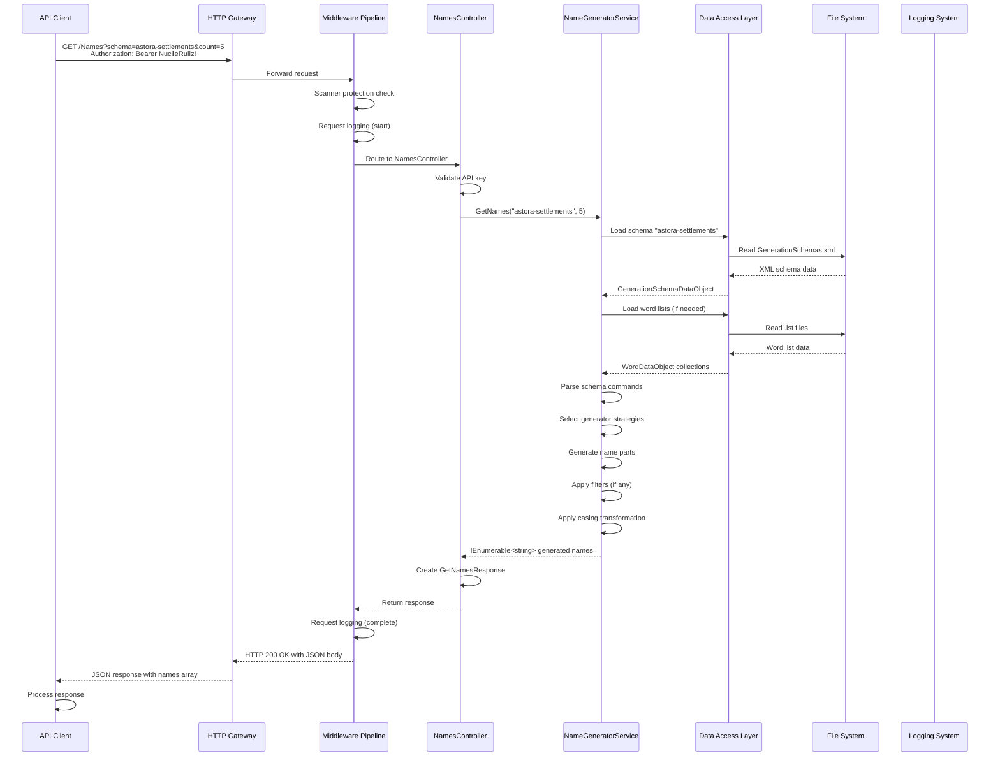

# Universal Name Generator API - Data Flow Documentation

## Overview

This document details the complete data flow through the Universal Name Generator API, from HTTP request to response generation, including all transformations, validations, and side effects.

---

## Complete Request Flow



---

## Detailed Data Transformations

### 1. HTTP Request Processing

**Input**:
```
GET /Names?schema=astora-settlements&count=5
Authorization: Bearer NucileRullz!
```

**Transformations**:
- URL parsing extracts query parameters
- Model binding converts to `GetNamesRequest`:
  - `Schema`: "astora-settlements" (string)
  - `Count`: 5 (int)
- Authorization header parsed for API key validation

### 2. Schema Resolution

**Input**: `GetNamesRequest` with `Schema="astora-settlements"`

**Process**:
1. `NameGeneratorService.GetSchemaById("astora-settlements")`
2. Calls `generationSchemaRepository.GetAll().ToServiceModels()`
3. XML repository reads `GenerationSchemas.xml`
4. Finds matching schema record

**Data Transformation**:
```
XML Record:
<GenerationSchemaDataObject>
  <Id>astora-settlements</Id>
  <Name>Astora Settlements</Name>
  <Category>Fantasy</Category>
  <Schema>{random,settlements|castles,3,15}{randomiser,-|-,3,8,settlements|castles}</Schema>
  <FilterlistPath>forbidden_names</FilterlistPath>
  <WordCase>Title</WordCase>
</GenerationSchemaDataObject>

→ GenerationSchema:
{
  Id: "astora-settlements",
  Name: "Astora Settlements",
  Category: "Fantasy",
  Schema: "{random,settlements|castles,3,15}{randomiser,-|-,3,8,settlements|castles}",
  FilterlistPath: "forbidden_names",
  WordCase: WordCase.Title
}
```

### 3. Word List Loading

**Input**: Schema with `FilterlistPath="forbidden_names"` and generator commands referencing word lists

**Process**:
1. For each word list referenced in schema:
   - Construct file path: `{wordListsRootDirectory}/{identifier}.lst`
   - Create `WordRepository` instance
   - Call `GetAll()` to load word data

**Data Transformation**:
```
File Content (settlements.lst):
settlements_Solara
settlements_Cluj-Napoca
settlements_Oradea
settlements_Nucilandia
settlements_Solaire
# Comment line

→ WordDataObject Collection:
[
  { Id: "settlements", Values: ["Solara", "Cluj-Napoca", "Oradea", "Nucilandia", "Solaire"] }
]
```

### 4. Schema Command Parsing

**Input**: Schema string `"{random,settlements|castles,3,15}{randomiser,-|-,3,8,settlements|castles}"`

**Process**:
1. Extract commands between `{` and `}`
2. Split each command by `,` to get parameters
3. Dispatch to appropriate generator based on first parameter

**Command 1**: `random,settlements|castles,3,15`
- Type: `random`
- Word lists: `["settlements", "castles"]`
- Min length: 3
- Max length: 15

**Command 2**: `randomiser,-|-,3,8,settlements|castles`
- Type: `randomiser`
- Separator: `-|-`
- Word lists: `["settlements", "castles"]`
- Min length: 3
- Max length: 8

### 5. Name Generation

**Input**: Parsed commands and loaded word lists

**Process for Random Command**:
1. Combine all values from specified word lists
2. For each name to generate:
   - Determine random length between min and max
   - Build string by randomly selecting from combined values
   - Repeat until target length reached

**Process for Randomiser Command**:
1. For each word list, load its values
2. For each name to generate:
   - For each word list:
     - Select random value from that list
   - Join all selected values with separator
   - Repeat until name count reached

### 6. Filter Application

**Input**: Generated names and filter list (if specified)

**Process**:
1. If `FilterlistPath` is specified:
   - Load filter words from `{wordListsRootDirectory}/{FilterlistPath}.lst`
   - Remove any generated names that exactly match filter words
   - Remove any generated names containing filter words as substrings

### 7. Casing Transformation

**Input**: Generated names and `WordCase` from schema

**Transformations**:
- `WordCase.Lower`: `name.ToLower()`
- `WordCase.Upper`: `name.ToUpper()`
- `WordCase.Title`: `name.ToTitleCase()`
- `WordCase.Sentence`: `name.ToSentenceCase()`
- Default: No transformation

### 8. Response Creation

**Input**: Final IEnumerable<string> of generated names

**Process**:
1. Create `GetNamesResponse` object
2. Set `Names` property to generated names
3. Return from controller
4. Framework serializes to JSON:
```json
{
  "success": true,
  "data": {
    "names": ["Solara-Cluj-Napoca", "Oradea-Nucilandia", ...]
  }
}
```

---

## Side Effects and External Interactions

### File System Access

**Read Operations**:
- `GenerationSchemas.xml`: Schema definitions
- `*.lst` files: Word lists and filter lists
- `appsettings.json`: Configuration (at startup only)
- `logfile.log`: Application logs (when enabled)

**Write Operations**:
- `logfile.log`: Request and operation logs (append-only)

### Logging

**Operations Logged**:
- `GenerateNames`: Name generation requests
- `GetSchemas`: Schema listing requests

**Log Info Keys**:
- `Schema`: Requested schema identifier
- `Count`: Requested number of names

**Log Content** (when file logging enabled):
```
[Timestamp] Operation: GenerateNames
  Info: Schema=astora-settlements, Count=5
[Timestamp] Operation: GenerateNames Completed
  Info: Schema=astora-settlements, Count=5, ResultCount=5
```

### Memory Usage

**Transient Data**:
- HTTP request objects
- `GetNamesRequest` and `GetNamesResponse`
- Schema and word list data objects
- Generated name strings
- Generator instances (cached per schema)

**Persistent Data**:
- Configuration settings (singleton)
- Cached generator instances (scoped to service lifetime)
- Logging buffers

---

## Error Conditions and Data Flow

### Authentication Failure

**Flow**:
1. Request arrives at middleware
2. Authorization header missing or invalid
3. Middleware returns 401 Unauthorized
4. No further processing occurs

**Data Impact**: No schema or word list loading

### Validation Failure

**Flow**:
1. Model binding fails (invalid count format)
2. Controller returns 400 Bad Request
3. No service call occurs

**Data Impact**: No external file access

### Schema Not Found

**Flow**:
1. Service attempts to resolve schema
2. Schema not found in XML repository
3. Service throws `KeyNotFoundException`
4. Middleware translates to 404 Not Found

**Data Impact**: Schema XML loaded, but no word list access

### File Access Failure

**Flow**:
1. Service attempts to load word list file
2. File not found or inaccessible
3. `FileNotFoundException` or `IOException` thrown
4. Middleware translates to 500 Internal Server Error

**Data Impact**: Partial processing; previously loaded data may be retained in memory

---

## Performance Characteristics

### Time Complexity

**Schema Resolution**: O(n) where n = number of schemas (typically small)
**Word List Loading**: O(m) where m = lines in file
**Name Generation**: O(k × l) where k = count, l = average name length
**Filter Application**: O(p × f) where p = generated names, f = filter words
**Casing Transformation**: O(p × l) where p = names, l = average length

### Space Complexity

**Memory Usage**:
- Schema cache: O(s) where s = schema count
- Word list cache: O(w) where w = total word list entries
- Generator cache: O(g) where g = unique schemas requested
- Name generation buffer: O(k × l) where k = count, l = max name length

### I/O Operations

**Per Request**:
- 1 schema file read (cached after first access)
- 0-n word list file reads (cached per file lifetime)
- 0-1 filter list file reads (cached per file lifetime)
- 2 log writes (request start and completion)

---

## Concurrency Considerations

### Thread Safety

**Immutable Data**:
- Configuration settings (after initialization)
- Schema data (after loading)
- Word list data (after loading)

**Mutable Data**:
- Generator instances (scoped to service, accessed per request)
- Logging buffers (thread-safe via NuciLog)
- HTTP context objects (per request)

### Resource Contention

**File System**:
- Multiple concurrent readers on same files
- OS-level caching minimizes physical I/O
- No file writes during normal operation

**Memory**:
- Garbage collection pressure from string generation
- Object pooling not implemented
- Generator instances reused per schema

---

## Data Integrity and Validation

### Input Validation

**Request Level**:
- Schema: String format validation (controller)
- Count: Range validation [1, 100000] (data annotations)
- Authorization: Header presence and format (middleware)

**Data Level**:
- Schema format: Validated during parsing
- Word list format: Validated during parsing
- Generator parameters: Validated during command parsing

### Output Sanitization

**Generated Names**:
- No HTML encoding (intended for programmatic consumption)
- No SQL escaping (no database interaction)
- Length constrained by schema parameters
- Content determined by word lists and algorithms

### Error Handling

**Exception Types**:
- `FileNotFoundException`: Missing schema or word list files
- `FormatException`: Malformed schema commands
- `ArgumentException`: Invalid parameter combinations
- `KeyNotFoundException`: Unknown schema identifier
- `NotSupportedException`: Unsupported generator command
- `IOException`: File access errors

**Translation**:
All exceptions caught by middleware and converted to appropriate HTTP responses with standardized error format.

---

## Data Flow Summary

The Universal Name Generator API follows a clean, layered data flow:

1. **Ingress**: HTTP request → Model binding → Validation
2. **Business Logic**: Schema resolution → Data loading → Generation → Transformation
3. **Egress**: Response creation → Serialization → HTTP response

**Key Characteristics**:
- Minimal data copying; references passed where possible
- Immutable data structures where feasible
- Clear separation of concerns between layers
- Comprehensive error handling at boundaries
- Observable side effects limited to logging
- Efficient caching of expensive resources (schemas, word lists, generators)

This data flow enables the system to be predictable, testable, and maintainable while providing high-performance name generation capabilities.