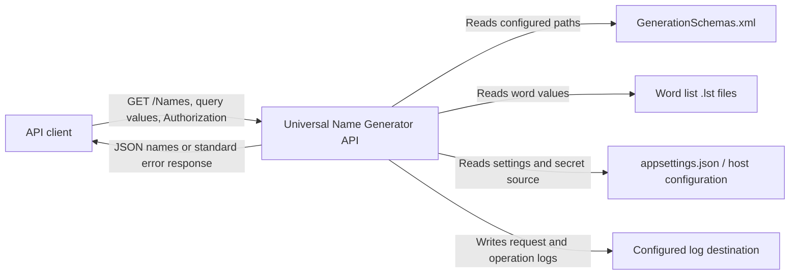
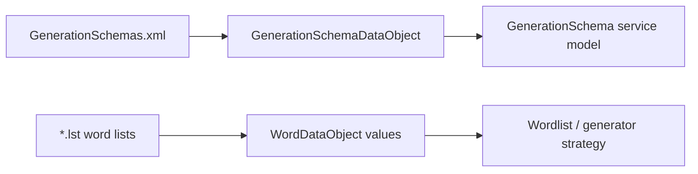
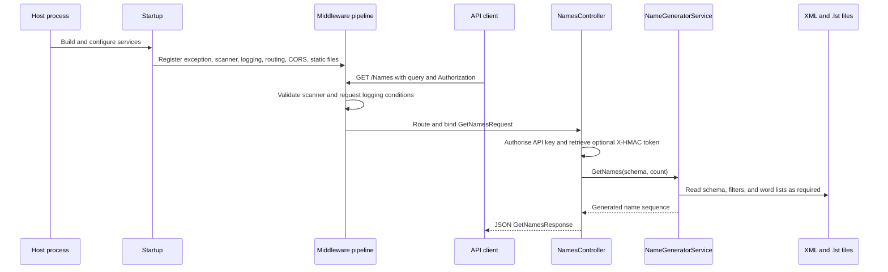

# Universal Name Generator API - Repository Semantic Model

## Overview

This document provides a comprehensive, implementation-grounded semantic model of the Universal Name Generator API repository. It captures the repository's purpose, architecture, component relationships, data flows, and execution semantics to enable future agents to understand and modify the system without requiring extensive source code exploration.

## Repository Purpose

The Universal Name Generator API is an ASP.NET Core REST service that provides configurable name generation capabilities. Its principal responsibility is to expose configurable name generation over an authenticated HTTP API, enabling clients to generate random names from predefined schemas and word lists.

**Core Business Logic:**
- Read generation schemas from XML files
- Load word lists from `.lst` files
- Support multiple generation strategies: random, randomiser, random-selector, and Markov chain
- Apply configurable casing, filtering, and composition rules
- Return generated names via HTTP API with authentication

**Primary External Interfaces:**
- HTTP API: `GET /Names` with schema and count parameters
- Configuration files: `appsettings.json`, XML schemas, `.lst` word lists
- Authentication: API key via `Authorization` header

## Architectural Decomposition

### System Context

The system operates as a single ASP.NET Core process with the following external boundaries:



**External Dependencies:**
1. **API Client**: Owns requests and consumes responses; provides API key
2. **Configuration Provider**: Owns configuration values and secrets
3. **Generation Data Files**: Own XML schemas and word lists; read-only
4. **Filesystem Log Destination**: Own persisted logs when file logging enabled

### Architectural Style

The implementation follows a **modular monolith** pattern with:

- **ASP.NET Core MVC**: HTTP request/response handling
- **Middleware Composition**: Cross-cutting concerns (security, logging, exception handling)
- **Dependency Injection**: Service registration and lifetime management
- **Layered Architecture**: Controllers → Services → Data Access → External Libraries

**Key Architectural Boundaries:**
- **Host and Pipeline**: `Program` and `Startup` compose the deployable process
- **HTTP Boundary**: `NamesController` owns route and request/response adaptation
- **Application Service**: `INameGeneratorService` owns business logic
- **Data Access**: File repositories adapt XML and text files to service models
- **External Libraries**: `NuciGenerators.Text` and related packages provide generation algorithms

## Component Analysis

### Core Components

#### 1. Host and Pipeline (`Program.cs`, `Startup.cs`, `ServiceCollectionExtensions.cs`)

**Purpose**: Create and configure the ASP.NET Core host and HTTP pipeline

**Responsibilities**:
- Create the generic web host and select `Startup` as web-host startup class
- Register services and configure middleware order
- Establish CORS, routing, authorization, and static file handling
- Bind configuration sections to settings objects

**Implementation Details**:
```csharp
// Program.cs
public static void Main(string[] args) => CreateHostBuilder(args).Build().Run();

// Startup.cs
public void ConfigureServices(IServiceCollection services) {
    services.AddControllers();
    services.AddCors(options => { /* CORS configuration */ });
    services.AddConfigurations(Configuration)
            .AddNuciApiScannerProtection()
            .AddCustomServices();
}

// ServiceCollectionExtensions.cs
public static IServiceCollection AddConfigurations(this IServiceCollection services, IConfiguration configuration) {
    services.AddSingleton(dataStoreSettings)
            .AddSingleton(securitySettings)
            .AddNuciLoggerSettings(configuration);
}
```

**Boundary Rules**:
- Composition code owns registration and ordering; does not implement name-generation algorithms
- Configuration values passed through settings objects, not read directly by controllers
- Middleware ordering is part of HTTP behavior and must be verified when changed

#### 2. HTTP Controller (`Controllers/NamesController.cs`)

**Purpose**: Expose HTTP endpoints and adapt requests/responses

**Responsibilities**:
- Route `GET /Names` requests
- Validate and bind `GetNamesRequest` model
- Perform API key authorization
- Call `INameGeneratorService.GetNames()`
- Create `GetNamesResponse` DTO

**Implementation Details**:
```csharp
[Route("[controller]")]
[ApiController]
public sealed class NamesController(
    INameGeneratorService nameGeneratorService,
    SecuritySettings securitySettings) : NuciApiController, INamesController
{
    private readonly NuciApiAuthorisation authorisation = NuciApiAuthorisation.ApiKey(securitySettings.ApiKey);

    [HttpGet]
    public ActionResult GetNames([FromQuery] GetNamesRequest request)
        => ProcessRequest(
            request,
            () => new GetNamesResponse { Names = nameGeneratorService.GetNames(request.Schema, request.Count) },
            authorisation);
}
```

**Dependencies**:
- `INameGeneratorService`: Business logic
- `SecuritySettings`: API key configuration
- `NuciApiController`: Base controller with request processing

#### 3. Application Service (`Service/NameGeneratorService.cs`)

**Purpose**: Core business logic for name generation

**Responsibilities**:
- Resolve schemas by identifier
- Load generation schemas from XML
- Load word lists from `.lst` files
- Select appropriate generator strategy based on schema command
- Apply filters, casing, and composition rules
- Cache generators by schema for performance

**Key Algorithms**:
- **Schema Parsing**: Extract generator commands from schema string using `{command}` syntax
- **Generator Selection**: Map command names to concrete implementations
- **Name Composition**: Combine generated parts with configurable casing
- **Caching**: Reuse generator instances per schema

**Implementation Complexity**:
- Supports 4 generation strategies: `random`, `randomiser`, `random-selector`, `markov`
- Handles schema parsing with nested generators
- Manages word list loading and filtering
- Applies multiple casing transformations (Lower, Upper, Title, Sentence)

#### 4. Data Access Layer (`DataAccess/Repositories/`, `DataAccess/DataObjects/`)

**Purpose**: Adapt file-based data sources to service models

**Components**:

##### XML Repository (`DataAccess/Repositories/XmlRepository.cs`)
- Reads `GenerationSchemas.xml` using `NuciDAL.XmlRepository<GenerationSchemaDataObject>`
- Provides `GetAll()` method for schema retrieval

##### Word Repository (`DataAccess/Repositories/WordRepository.cs`)
- Parses `.lst` files with format `identifier_value`
- Strips inline comments starting with `#`
- Groups values by identifier
- Provides `GetAll()` method for word list retrieval

##### Data Objects (`DataAccess/DataObjects/GenerationSchemaDataObject.cs`)
- `GenerationSchemaDataObject`: Represents XML schema records
  - Properties: `Name`, `Category`, `Schema`, `FilterlistPath`, `WordCase`
  - Implements `IEquatable<GenerationSchemaDataObject>` based on `Id`

##### Mapping Extensions (`Service/Mappings/GenerationSchemaMappingExtensions.cs`, `WordMappingExtensions.cs`)
- Convert data objects to service models
- Bridge between data access and application service layers

#### 5. External Generator Libraries

**NuciGenerators.Text Ecosystem**:
- `NuciGenerators.Text`: Base text generation primitives
- `NuciGenerators.Text.MarkovChain`: Markov chain implementation
- `NuciGenerators.Text.Models`: Data models for generation

**Integration**: The application configures and invokes these libraries but does not own their internal algorithms.

### Supporting Components

#### Configuration Models (`Configuration/DataStoreSettings.cs`, `SecuritySettings.cs`)
- `DataStoreSettings`: File paths for word lists and schemas
- `SecuritySettings`: API key for authentication

#### Logging (`Logging/MyOperation.cs`, `MyLogInfoKey.cs`)
- `MyOperation`: Defines operations for logging (`GenerateNames`, `GetSchemas`)
- `MyLogInfoKey`: Defines log info keys (`Schema`, `Count`)

#### Interfaces (`Service/INameGeneratorService.cs`, `Controllers/INamesController.cs`)
- Define contracts between layers
- Enable testability and dependency injection

## Data Architecture

### Data Flow



### Data Ownership

**Application-Owned Data**:
- Transient request data (schema, count, generated names)
- In-memory caches (generator instances, word lists)

**External Data Sources**:
- **Generation Schemas**: XML files defining generation commands and rules
- **Word Lists**: `.lst` files containing words grouped by identifiers
- **Configuration**: `appsettings.json` and host configuration

**Data Transformations**:
1. XML → `GenerationSchemaDataObject` → `GenerationSchema` (service model)
2. `.lst` files → `WordDataObject` → `Word` (service model)
3. Schema commands → Generator strategy selection
4. Generated parts → Composed names with casing applied

### File Format Specifications

#### Word List Format (`.lst` files)
```
identifier_value1
identifier_value2
# This is a comment
another_identifier_another_value
```

**Parsing Rules**:
- Lines starting with `#` are comments and ignored
- Format: `identifier_value` where `_` separates identifier from value
- Values are grouped by identifier
- If no `_` present, entire line is identifier with single value

#### Schema Format
Schema strings contain generator commands in `{command}` syntax:
```
{random,wordlist1|wordlist2,1,10}text{randomiser,wordlist1|wordlist2,separator,1,10}{markov,wordlist1|wordlist2,1,10}
```

**Command Syntax**:
- `random`: Simple random string generation
- `randomiser`: Random combination with separator
- `random-selector`: Random selection from word lists
- `markov`: Markov chain-based generation

## Execution Flow Analysis

### Runtime Sequence



### Detailed Execution Path

1. **Host Initialization**:
   - `Program.CreateHostBuilder()` creates generic host
   - `Startup` selected as web-host startup class
   - Services registered, middleware pipeline configured

2. **Request Processing**:
   - HTTP request reaches `NamesController.GetNames()`
   - Model binding converts query parameters to `GetNamesRequest`
   - API key authorization performed via `NuciApiAuthorisation.ApiKey()`
   - `INameGeneratorService.GetNames()` called with schema and count

3. **Name Generation**:
   - Schema resolved to `GenerationSchema` object
   - Required files loaded (schema, filterlist, word lists)
   - Generator strategy selected based on command type
   - Names generated according to strategy parameters
   - Filters applied, casing transformed, names composed

4. **Response**:
   - Generated names returned in `GetNamesResponse`
   - Middleware translates exceptions to standard HTTP errors
   - JSON response sent to client

## Configuration Analysis

### Configuration Structure

**appsettings.json** contains:
```json
{
    "DataStoreSettings": {
        "wordListsRootDirectory": "path/to/wordlists",
        "generationSchemasPath": "path/to/schemas/GenerationSchemas.xml"
    },
    "SecuritySettings": {
        "apiKey": "[[UNIVERSAL_NAME_GENERATOR_API_KEY]]"
    },
    "nuciLoggerSettings": {
        "logFilePath": "path/to/logfile.log",
        "isFileOutputEnabled": true
    }
}
```

### Configuration Binding

**ServiceCollectionExtensions.AddConfigurations()**:
```csharp
services.AddConfigurations(Configuration)
    .AddNuciApiScannerProtection()
    .AddCustomServices();
```

**Settings Objects**:
- `DataStoreSettings`: File system paths
- `SecuritySettings`: Authentication key
- `NuciLoggerSettings`: Logging configuration

### Configuration Dependencies

**Configuration Consumers**:
- `NameGeneratorService`: Reads `DataStoreSettings` for file paths
- `NamesController`: Reads `SecuritySettings` for API key
- `Startup`: Configures CORS origins and middleware

**Configuration Validation**:
- No explicit validation in current implementation
- Relies on file system availability at runtime
- API key must match configured value for authorization

## Testing and Verification

### Test Architecture

**Three-tier test structure**:
1. **Unit Tests** (`UniversalNameGenerator.API.UnitTests/`): Test individual components
2. **Integration Tests** (`UniversalNameGenerator.API.IntegrationTests/`): Test HTTP contracts and middleware
3. **End-to-End Tests** (`EndToEnd/`): Test complete workflows

### Integration Test Infrastructure

**UniversalNameGeneratorApiFactory**:
- Hosts complete production HTTP pipeline
- Mocks `INameGeneratorService` for isolated testing
- Configures in-memory settings for test isolation
- Supports both mocked and real service scenarios

**Test Coverage Areas**:
- **NamesControllerTests**: Valid requests, count ranges, schema encoding, query parameter handling
- **NamesControllerAuthorisationTests**: API key validation, header variations, authentication failures
- **NamesControllerValidationTests**: Count validation, schema validation, parameter binding

### Test Data

**Test Schemas**:
- `astora-settlements`: Used in most tests
- `arabic-toponyms`, `city-selection`: Additional test schemas

**Expected Test Results**:
- Deterministic name generation for testing
- Consistent behavior across test runs
- Mocked service responses for isolation

## Extension Points

### Name Generator Service Substitution

**Extension Mechanism**: The `INameGeneratorService` interface can be replaced with custom implementations.

**Current Implementations**:
- `NameGeneratorService`: Default implementation
- Mock implementations for testing

**Extension Strategy**:
1. Implement `INameGeneratorService`
2. Register in `Startup.ConfigureServices()`
3. Override default registration

### Data-Driven Generator Extension

**Extension Mechanism**: New generator strategies can be added by:
1. Implementing `INameGenerator` from `NuciGenerators.Text`
2. Adding to `NuciGenerators.Text` ecosystem
3. Configuring in schema commands

**Current Strategies**:
- `random`: Simple random string
- `randomiser`: Random combination with separator
- `random-selector`: Random selection
- `markov`: Markov chain generation

## Dependency Analysis

### Dependency Direction

**Forward Dependencies** (owned by dependents):
- Controllers depend on service contracts
- Services depend on data access
- Data access depends on file system

**Reverse Dependencies** (own dependents):
- Host depends on all application components
- Configuration depends on external data sources

### External Dependencies

**NuGet Packages**:
- `NuciAPI` 3.6.1: Core API abstractions
- `NuciAPI.Controllers` 2.3.1: Controller utilities
- `NuciAPI.Middleware.*`: Various middleware components
- `NuciDAL` 3.2.1: Data access abstractions
- `NuciExtensions` 5.3.2: Shared extension methods
- `NuciGenerators.Text*`: Generation algorithms
- `NuciLog*`: Logging implementation
- `NuciSecurity.HMAC` 4.1.3: HMAC authentication

### Dependency Rules

**Service Lifetime Management**:
- `DataStoreSettings`: Singleton (configuration)
- `SecuritySettings`: Singleton (configuration)
- `INameGeneratorService`: Scoped (per request)
- `ILogger`: Scoped (per request)

**Configuration Dependencies**:
- Settings objects created during service registration
- Configuration values bound at composition time
- No runtime configuration changes without restart

## Cross-Cutting Concerns

### Security

**Authentication Mechanism**:
- API key required in `Authorization` header
- Supports `Bearer` prefix or direct key
- Constant-time comparison via `NuciSecurity.HMAC`
- HMAC token optional but recommended

**Security Boundaries**:
- API key validation at controller level
- Scanner protection middleware
- Request logging with sensitive data filtering
- No exposure of internal algorithms or data

### Error Handling

**Exception Translation**:
- `NuciAPI.Middleware.ExceptionHandling`: Translates exceptions to HTTP errors
- Standardized error responses via `NuciApiResponse`
- Validation errors with detailed messages

**Error Categories**:
- Authentication failures (401)
- Validation errors (400)
- Not found errors (404)
- Format errors (400)
- Unsupported operations (501)

### Observability

**Logging Infrastructure**:
- `NuciLog` with file output support
- Operation-based logging (`GenerateNames`, `GetSchemas`)
- Log info keys (`Schema`, `Count`)
- Request and operation logging middleware

**Log Content**:
- Schema identifier and count for each request
- Operation timestamps
- No sensitive data (API keys, request bodies) logged

### Concurrency and Resource Use

**Concurrency Model**:
- ASP.NET Core built-in request processing
- Scoped services per request
- File I/O for schema and word list loading
- In-memory generator caching

**Resource Management**:
- File handles managed by `StreamReader`
- Memory usage for word lists and generated names
- Generator instances cached per schema
- No database connections or external network calls

## Compatibility Contracts

### Public API Contract

**HTTP Endpoint**:
```http
GET /Names?schema={schemaId}&count={count}
Authorization: Bearer {apiKey}
```

**Request Parameters**:
- `schema`: Schema identifier (required, case-insensitive)
- `count`: Number of names to generate (optional, default: 1, range: 1-100000)

**Response Format**:
```json
{
    "success": true,
    "data": {
        "names": ["GeneratedName1", "GeneratedName2", ...]
    }
}
```

**Error Response Format**:
```json
{
    "success": false,
    "error": {
        "code": "ErrorCode",
        "message": "Error description"
    }
}
```

### Schema Contract

**Schema Format**: `{command,param1,param2,...}` syntax

**Supported Commands**:
- `random,minLength,maxLength,wordlist1|wordlist2`
- `randomiser,separator,wordlist1|wordlist2,minLength,maxLength,wordlistKeys`
- `random-selector,minLength,maxLength,wordlistKeys`
- `markov,minLength,maxLength,wordlistKeys`

## Design Constraints

### Technical Constraints

**Platform**: .NET 10.0 runtime required
**Architecture**: Single-process ASP.NET Core application
**Data Storage**: File-based (no database)
**Concurrency**: HTTP request processing

### Operational Constraints

**Configuration**: Must be set before deployment
**Security**: API key must not be committed to source control
**File System**: Word lists and schemas must be accessible
**Logging**: File permissions required for log output

## Future Considerations

### Scalability

**Current Limitations**:
- Single process architecture
- File-based data storage
- No distributed caching
- Limited concurrency

**Potential Improvements**:
- Distributed caching for word lists
- Database for schema management
- Load balancing for high traffic
- Background processing for large generation requests

### Maintainability

**Code Quality Issues**:
- Hard-coded command names and indices in `NameGeneratorService`
- Complex schema parsing logic
- Tight coupling between service and data access

**Improvement Opportunities**:
- Command pattern for generator strategies
- Schema parsing abstraction
- Repository pattern for data access
- Configuration-driven command definitions

### Testing Recommendations

**Current Coverage Gaps**:
- Integration tests mock service but test HTTP layer
- Limited error condition testing
- No performance testing
- No security penetration testing

**Recommended Enhancements**:
- Property-based testing for schema parsing
- Load testing for high-volume scenarios
- Security testing for authentication bypass attempts
- Chaos testing for failure scenarios

## Conclusion

This semantic model provides a comprehensive understanding of the Universal Name Generator API repository. It captures:

1. **System Purpose**: Configurable name generation via HTTP API
2. **Architecture**: Modular monolith with layered service/data access separation
3. **Component Relationships**: Clear boundaries and dependencies
4. **Data Flows**: Complete execution path from request to response
5. **Configuration Management**: Settings binding and validation
6. **Testing Strategy**: Three-tier test architecture with comprehensive coverage
7. **Extension Points**: Service substitution and data-driven generator extension
8. **Cross-Cutting Concerns**: Security, error handling, observability
9. **Compatibility Contracts**: Public API and schema specifications
10. **Design Constraints**: Technical and operational limitations

This model enables future agents to understand the repository's semantics without requiring extensive source code exploration, supporting maintenance, enhancement, and extension activities.