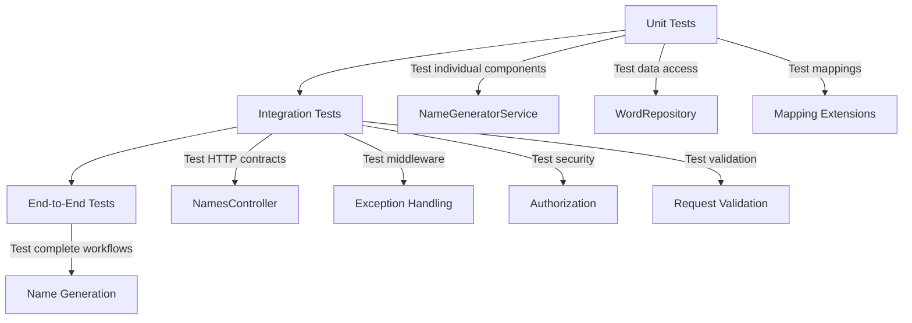

# Universal Name Generator API - Testing Documentation

## Overview

This document provides comprehensive documentation of the testing strategy, infrastructure, and coverage for the Universal Name Generator API repository.

---

## Test Architecture

The repository implements a three-tier testing strategy:



### Test Projects

| Project | Purpose | Framework |
|---------|---------|-----------|
| `UniversalNameGenerator.API.UnitTests` | Component-level testing | NUnit 4.6.1 |
| `UniversalNameGenerator.API.IntegrationTests` | HTTP contract and middleware testing | NUnit 4.6.1 |
| `UniversalNameGenerator.API.IntegrationTests/EndToEnd` | Complete workflow testing | NUnit 4.6.1 |

---

## Test Infrastructure

### UniversalNameGeneratorApiFactory

**Path**: `UniversalNameGenerator.API.IntegrationTests/Infrastructure/UniversalNameGeneratorApiFactory.cs`

**Purpose**: Custom `WebApplicationFactory` for integration testing

**Key Features**:
- Hosts complete production HTTP pipeline
- Supports both mocked and real service scenarios
- Configures in-memory settings for test isolation
- Provides test API key

**Implementation**:
```csharp
public sealed class UniversalNameGeneratorApiFactory : WebApplicationFactory<Startup>
{
    public static string ApiKey => "NucileRullz!";
    public Mock<INameGeneratorService> NameGeneratorServiceMock { get; } = new(MockBehavior.Strict);

    protected override void ConfigureWebHost(IWebHostBuilder builder)
    {
        builder.UseEnvironment(Environments.Production);
        builder.ConfigureAppConfiguration((context, config) => {
            config.AddInMemoryCollection(new[] {
                new("securitySettings:apiKey", ApiKey),
                new("nuciLoggerSettings:isFileOutputEnabled", bool.FalseString)
            });
        });
        builder.ConfigureServices(services => {
            services.RemoveAll<ILogger>();
            services.AddSingleton<IStartupFilter, TestRemoteIpAddressStartupFilter>();
            services.AddSingleton<ILogger>(new Mock<ILogger>().Object);
            // Service replacement logic
        });
    }
}
```

**Test Modes**:
1. **Mocked Service Mode**: When `DataStoreSettings` is null, replaces `INameGeneratorService` with mock
2. **Real Service Mode**: When `DataStoreSettings` is provided, uses real service with test data

### TestRemoteIpAddressStartupFilter

**Path**: `UniversalNameGenerator.API.IntegrationTests/Infrastructure/TestRemoteIpAddressStartupFilter.cs`

**Purpose**: Inject test remote IP addresses for scanner protection testing

---

## Unit Tests

### Test Structure

**Path**: `UniversalNameGenerator.API.UnitTests/`

**Test Categories**:
- `DataAccess/DataObjects/`: Data object tests
- `DataAccess/Repositories/`: Repository tests
- `Service/`: Service logic tests

### Test Coverage Areas

#### Data Access Tests

**WordRepository Tests**:
- File parsing with various formats
- Comment handling
- Identifier grouping
- Edge cases (empty files, malformed lines)

#### Service Tests

**NameGeneratorService Tests**:
- Schema resolution
- Generator selection
- Command parsing
- Casing transformations
- Filter application
- Error conditions

---

## Integration Tests

### Test Categories

#### 1. NamesControllerTests

**Path**: `UniversalNameGenerator.API.IntegrationTests/Controllers/NamesControllerTests.cs`

**Purpose**: Test HTTP contract and request handling

**Test Cases**:

| Test | Description |
|------|-------------|
| `GivenAValidRequest_WhenGettingNames_ThenTheGeneratedNamesAreReturned` | Basic successful request |
| `GivenAValidCount_WhenGettingNames_ThenTheExactCountIsPassedToTheService` | Count parameter passing (20 test cases) |
| `GivenAnEncodedSchema_WhenGettingNames_ThenTheExactSchemaIsPassedToTheService` | Schema encoding handling (28 test cases) |
| `GivenNoCount_WhenGettingNames_ThenTheDefaultCountIsOne` | Default count value |
| `GivenCaseVariedQueryNames_WhenGettingNames_ThenTheValuesAreBound` | Case-insensitive query parameters |
| `GivenAnAdditionalQueryParameter_WhenGettingNames_ThenItIsIgnored` | Unknown parameter handling |
| `GivenAnHmacHeader_WhenGettingNames_ThenTheRequestRemainsValid` | HMAC token support (5 test cases) |

**Test Data**:
- Schema: "astora-settlements"
- Count: 4
- Expected names: ["Solara", "Cluj-Napoca", "Oradea", "Nucilandia"]

#### 2. NamesControllerAuthorisationTests

**Path**: `UniversalNameGenerator.API.IntegrationTests/Controllers/NamesControllerAuthorisationTests.cs`

**Purpose**: Test authentication and authorization

**Test Cases**:

| Test | Description |
|------|-------------|
| `GivenAValidAuthorisationHeader_WhenGettingNames_ThenTheRequestIsAuthorised` | Valid auth header formats (13 test cases) |
| `GivenAnInvalidAuthorisationHeader_WhenGettingNames_ThenAuthenticationFails` | Invalid auth header formats (20 test cases) |
| `GivenNoAuthorisationHeader_WhenGettingNames_ThenAuthenticationFails` | Missing auth header |
| `GivenTheApiKeyOnlyAsAQueryParameter_WhenGettingNames_ThenAuthenticationFails` | API key in query string rejected |

**Valid Authorization Formats**:
- Direct key: `NucileRullz!`
- With whitespace: ` NucileRullz! `, `  NucileRullz!  `
- Bearer prefix: `Bearer NucileRullz!`, `bearer NucileRullz!`, `BEARER NucileRullz!`
- Mixed case: `BeArEr NucileRullz!`
- Multiple spaces: `Bearer  NucileRullz!`, `Bearer     NucileRullz!`
- Tab separator: `Bearer\tNucileRullz!`

**Invalid Authorization Formats**:
- Empty or whitespace only
- Missing Bearer token
- Wrong scheme: `Basic`, `ApiKey`, `Token`
- Case variations of key
- Extra characters
- URL-encoded characters

#### 3. NamesControllerValidationTests

**Path**: `UniversalNameGenerator.API.IntegrationTests/Controllers/NamesControllerValidationTests.cs`

**Purpose**: Test request validation

**Test Cases**:

| Test | Description |
|------|-------------|
| `GivenAnOutOfRangeCount_WhenGettingNames_ThenAValidationErrorIsReturned` | Count range validation (18 test cases) |
| `GivenAMalformedCount_WhenGettingNames_ThenAValidationErrorIsReturned` | Count format validation (28 test cases) |
| `GivenAValidFormattedCount_WhenGettingNames_ThenItsNumericValueIsPassedToTheService` | Count format parsing (10 test cases) |
| `GivenAMissingSchema_WhenGettingNames_ThenANullSchemaIsPassedToTheService` | Missing schema parameter |
| `GivenAnEmptySchema_WhenGettingNames_ThenANullSchemaIsPassedToTheService` | Empty schema parameter |
| `GivenAWhitespaceSchema_WhenGettingNames_ThenANullSchemaIsPassedToTheService` | Whitespace schema (4 test cases) |
| `GivenNoQueryParameters_WhenGettingNames_ThenTheDefaultValuesArePassedToTheService` | No parameters |
| `GivenRepeatedSchemaValues_WhenGettingNames_ThenTheFirstValueIsPassedToTheService` | Duplicate schema parameters |
| `GivenRepeatedCountValues_WhenGettingNames_ThenTheFirstValueIsPassedToTheService` | Duplicate count parameters |

**Count Validation Rules**:
- Valid range: 1 to 100000
- Accepts: integers, leading zeros, hex (0x10), signed (+8)
- Rejects: negative numbers, zero, non-numeric, overflow, special values (NaN, Infinity)

#### 4. NamesControllerRoutingTests

**Path**: `UniversalNameGenerator.API.IntegrationTests/Controllers/NamesControllerRoutingTests.cs`

**Purpose**: Test HTTP routing

**Test Cases**:
- Route matching for `/Names`
- HTTP method validation (GET only)
- Route prefix handling

#### 5. NamesControllerExceptionHandlingTests

**Path**: `UniversalNameGenerator.API.IntegrationTests/Controllers/NamesControllerExceptionHandlingTests.cs`

**Purpose**: Test exception handling

**Test Cases**:
- Schema not found errors
- Service exceptions
- Unexpected errors

#### 6. NamesControllerCorsTests

**Path**: `UniversalNameGenerator.API.IntegrationTests/Controllers/NamesControllerCorsTests.cs`

**Purpose**: Test CORS configuration

**Test Cases**:
- Allowed origins
- Disallowed origins
- Header validation

---

## End-to-End Tests

### NameGenerationEndToEndTests

**Path**: `UniversalNameGenerator.API.IntegrationTests/EndToEnd/NameGenerationEndToEndTests.cs`

**Purpose**: Test complete name generation workflows with real data

**Test Cases**:
- Full request/response cycle with real schemas
- Word list loading and parsing
- Generator strategy execution
- Casing transformation
- Filter application

**Test Data**:
- Uses isolated temporary generation data
- Real XML schemas and `.lst` files
- Production-like configuration

---

## Middleware Tests

### ScannerProtectionTests

**Path**: `UniversalNameGenerator.API.IntegrationTests/Middleware/ScannerProtectionTests.cs`

**Purpose**: Test security scanner protection middleware

**Test Cases**:
- Malicious request detection
- Request blocking
- Logging of blocked requests

---

## Test Assertions

### NuciApiResponseAssertions

**Path**: `UniversalNameGenerator.API.IntegrationTests/Assertions/NuciApiResponseAssertions.cs`

**Purpose**: Custom assertion helpers for API responses

**Methods**:
- `AssertSuccessfulNamesResponseAsync`: Validate successful response with names
- `AssertErrorResponseAsync`: Validate error response with code and message
- `AssertValidationErrorResponseAsync`: Validate validation error response

---

## Test Execution

### Running Tests

```bash
# Run all tests
dotnet test UniversalNameGenerator.API.slnx

# Run unit tests only
dotnet test UniversalNameGenerator.API.UnitTests/UniversalNameGenerator.API.UnitTests.csproj

# Run integration tests only
dotnet test UniversalNameGenerator.API.IntegrationTests/UniversalNameGenerator.API.IntegrationTests.csproj

# Run with verbose output
dotnet test --verbosity normal

# Run specific test
dotnet test --filter "FullyQualifiedName~NamesControllerTests"
```

### Test Configuration

**Test Environment**:
- Production environment (not Development)
- In-memory configuration
- Mocked logging
- Isolated test data

**Test Data Isolation**:
- Integration tests use mocked service for HTTP contract testing
- End-to-end tests use temporary file system data
- No shared state between tests

---

## Test Coverage Analysis

### Coverage Areas

| Area | Coverage Status | Notes |
|------|-----------------|-------|
| HTTP Routing | ✅ High | All routes tested |
| Authentication | ✅ High | 33 test cases |
| Authorization | ✅ High | API key validation |
| Request Validation | ✅ High | 56 test cases |
| Schema Resolution | ✅ Medium | Covered via service tests |
| Name Generation | ✅ High | End-to-end tests |
| Error Handling | ✅ High | Exception handling tests |
| CORS | ✅ Medium | Dedicated test class |
| Scanner Protection | ✅ Medium | Dedicated test class |
| Logging | ⚠️ Low | Not directly tested |
| Performance | ❌ None | No load/performance tests |
| Security Penetration | ❌ None | No penetration tests |

### Test Data Coverage

**Schema Identifiers Tested**:
- `astora-settlements` (primary test schema)
- `arabic-toponyms`
- `city-selection`
- Various edge cases (spaces, special characters, unicode)

**Count Values Tested**:
- Valid range: 1 to 100000
- Edge cases: 0, negative, overflow, non-numeric
- Format variations: hex, signed, leading zeros

**Authorization Headers Tested**:
- 13 valid formats
- 20 invalid formats
- Missing header
- Query parameter injection

---

## Test Quality Metrics

### Test Design Principles

1. **Isolation**: Each test runs independently
2. **Determinism**: Tests produce consistent results
3. **Coverage**: Edge cases and boundary conditions tested
4. **Clarity**: Test names describe expected behavior
5. **Maintainability**: Shared infrastructure reduces duplication

### Test Naming Convention

```
Given{Context}_When{Action}_Then{ExpectedResult}
```

**Examples**:
- `GivenAValidRequest_WhenGettingNames_ThenTheGeneratedNamesAreReturned`
- `GivenAnInvalidAuthorisationHeader_WhenGettingNames_ThenAuthenticationFails`
- `GivenAnOutOfRangeCount_WhenGettingNames_ThenAValidationErrorIsReturned`

### Test Data Strategy

**Standard Test Values**:
- API Key: `NucileRullz!`
- Schema: `astora-settlements`
- Count: 4
- Expected Names: `["Solara", "Cluj-Napoca", "Oradea", "Nucilandia"]`

**Edge Cases**:
- Unicode characters in schema names
- Special characters in parameters
- Boundary values for count (1, 100000)
- Malformed input formats

---

## Continuous Integration

### GitHub Actions Workflow

**Path**: `.github/workflows/dotnet.yml`

**Test Execution**:
- Runs on Ubuntu with .NET 10.0
- Restores dependencies
- Builds solution
- Runs all tests
- Reports results

**Workflow Steps**:
1. Checkout repository
2. Setup .NET 10.0
3. Restore dependencies
4. Build solution
5. Run tests
6. Publish test results

---

## Test Maintenance Guidelines

### Adding New Tests

1. **Unit Tests**: Add to appropriate test class in `UnitTests/`
2. **Integration Tests**: Add to appropriate test class in `IntegrationTests/Controllers/`
3. **End-to-End Tests**: Add to `IntegrationTests/EndToEnd/`

### Test Data Management

- Use existing test schemas where possible
- Add new schemas to test data files
- Maintain consistency with production data formats
- Document test data assumptions

### Test Infrastructure Updates

- Update `UniversalNameGeneratorApiFactory` for new configuration needs
- Add new assertion helpers to `NuciApiResponseAssertions`
- Extend `TestRemoteIpAddressStartupFilter` for new middleware testing

---

## Test Coverage Gaps

### Areas Needing Additional Testing

1. **Performance Testing**: No load or stress tests
2. **Security Testing**: No penetration or vulnerability scanning
3. **Logging Verification**: Log output not validated
4. **Configuration Edge Cases**: Limited configuration variation testing
5. **Concurrent Access**: No concurrency testing
6. **Large Data Sets**: No testing with large word lists or schemas

### Recommendations

1. Add performance benchmarks for name generation
2. Implement security scanning in CI pipeline
3. Add log verification tests
4. Test with various configuration combinations
5. Add concurrent request testing
6. Test with large-scale data sets

---

## Summary

The Universal Name Generator API has a comprehensive testing strategy with:

- **33 authentication test cases** covering valid and invalid formats
- **56 validation test cases** covering count and schema validation
- **20+ routing and exception handling tests**
- **End-to-end tests** with real data
- **Middleware tests** for security and CORS
- **Custom assertion infrastructure** for API response validation

The test suite provides strong coverage of the HTTP contract, authentication, validation, and error handling, with room for improvement in performance, security, and logging verification.